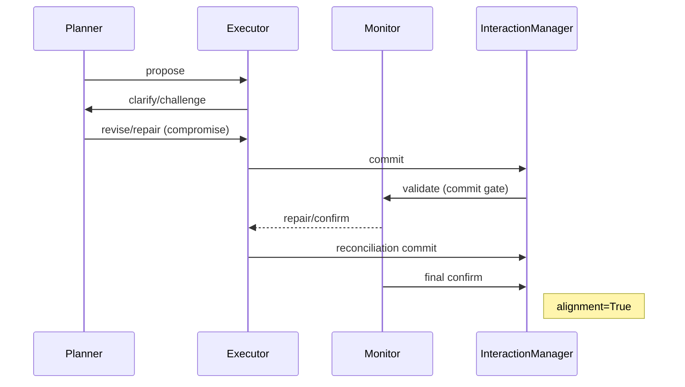

# HI-MACP v1.0 — Formal Specification

This document formalizes the HI-MACP (Human-Inspired Multi-Agent Communication Protocol) as implemented in the MVP. It defines the message schema, state machines, divergence taxonomy (EC1–EC20), alignment/termination conditions, delegation rules, and tradeoff negotiation rules. It is intended as the API contract for developers and the reference for research/production.

---

## 1) Message Schema (Canonical)
All messages are JSON objects with mandatory fields:
```json
{
  "id": "string",             // filled by runtime
  "timestamp": "ISO_8601",    // filled by runtime
  "sender": "AgentA|AgentB|AgentM|InteractionManager",
  "receiver": "agent_name_or_group",
  "type": "propose|clarify|revise|challenge|repair|commit|confirm|inform",
  "content": {},              // type-specific payload
  "context": {},              // goal/phase hints
  "assumptions": [],          // explicit assumptions
  "confidence": 0.0           // 0..1
}
```

Type-specific invariants:
- `propose` / `revise`: `content.plan` MUST be a non-empty list.
- `clarify`: `content.issue` (or `question`) MUST be non-empty.
- `challenge`: `content.assumption` SHOULD be provided.
- `repair`: `content.conflict` MUST describe the inconsistency; may include `plan`.
- `commit`: `content.commitment` MUST exist (`accept_plan` or `accept_plan_reconciled`), and `content.plan` MUST be a non-empty list.
- `confirm`: `content.alignment` SHOULD be set (e.g., `"ack"`).
- `tool_action`: `content.action` (e.g., `kubectl_apply`, `smoke_test`), `content.mode` in `simulate|dry-run|execute`, optional `target`, `extra`.

Runtime fills `id`, `timestamp`, `sender`, `receiver`, `confidence` if missing. The adapter may coerce `steps` -> `plan`, strings -> single-item plan list.

Valid transitions (high-level):
- propose -> clarify/challenge -> revise/repair -> commit -> confirm
- propose -> commit is illegal if no clarify/challenge occurred.
- commit is illegal if a challenge exists without a subsequent revise/repair.
- monitor/IM repair can insert repair at any point; agents must respond before committing.

---

## 2) State Machines (Core Agents & Manager)

### Planner (AgentA)
- Initial: read shared -> `propose(plan)` (secure-leaning variants, aligns claimed_tasks).
- On `clarify`/`challenge`: MUST respond with `revise` or `repair` (compromise revision if challenge).
- On monitor repair/clarify: respond with `revise`/`repair` addressing issues.
- No `commit`.

### Executor (AgentB)
- On new proposal: SHOULD `clarify`/`challenge` at least once before any commit.
- Prefers fast variants; challenges secure-heavy or capability gaps.
- If last step was `challenge` and no `revise/repair` followed, MUST NOT commit (sends clarify/wait).
- Can `commit` once grounding satisfied and no unresolved monitor request.

### Monitor (AgentM)
- Reviews shared; if unresolved or missing debate -> `repair` (sets `monitor_request_pending` + `plan_status=repair_required`).
- Confirms only when: tasks present, plan_status=committed, debate quality satisfied (challenge + revise/repair, tradeoff note when role_goals set).
- On confirm: clears monitor_pending, sets plan_status=committed.

### Interaction Manager (IM)
- Validates schema + semantics.
- Role gate: only Planner may propose; only Executor (or IM) may commit.
- Commit gate:
  - Blocks if monitor_request_pending or plan_status=repair_required.
  - Blocks if plan_status=proposed and no clarify/challenge.
  - Blocks if any challenge exists and no revise/repair in history.
  - Blocks duplicate reconciliation commits and repeat commits with identical plan.
  - Blocks deploy commits when executor lacks credentials (unless delegated and allowed).
  - Blocks if tradeoff negotiation not observed when role_goals exist.
- Logs messages, updates shared SMM, detects divergence, auto-issues repair on divergence/validation failure.

### Tool Executor (ToolExecutor)
- Receives `tool_action` messages, runs/simulates commands via CommandRunner.
- Responds with `inform` on success, `repair` on failure/unauthorized/not_found/timeout.
- Reports capability profile (available binaries, allow_execute flag).

---

## 3) Divergence Taxonomy (EC1–EC20)
These are the official error modes used in tests and runtime:
- EC1_refusal: agent refuses; monitor pending prevents alignment.
- EC2_nonsense_clarify: clarify missing issue -> schema failure.
- EC3_self_contradiction: contradiction flag in world_state.
- EC4_hallucinated_steps: plan vs claimed_tasks mismatch.
- EC5_goal_drift: multiple active goals without isolation.
- EC6_endless_challenge: >=3 challenges without commit.
- EC7_resource_disagreement: commit blocked due to missing credentials.
- EC8_monitor_cannot_resolve: monitor attempts exhausted.
- EC9_invalid_plan: planner fallback to valid plan after invalid LLM output.
- EC10_memory_corruption: tasks structure corrupted.
- EC11_schema_failures: missing required commit fields.
- EC12_role_confusion: role gate violation.
- EC13_deadlock: unaligned after repair with monitor off.
- EC14_multi_task: multi-goal/task count mismatch.
- EC15_timeout_cascade: failure_mode=timeout_cascade.
- EC16_tradeoff_missing: commit blocked—challenge unanswered by revise/repair.
- EC17_confidence_gate: commit rejected—no clarify/challenge after proposal.
- EC18_monitor_tradeoff_missing: monitor flags missing tradeoff debate.
- EC19_multi_challenge_chain: commit blocked—challenge unanswered by revise/repair.
- EC20_logging: SQLite logging ensured.

Runtime divergence detection aligns to these categories.

---

## 4) Alignment & Termination
- `alignment=True` iff:
  - `commitments.plan_status == "committed"`
  - `tasks` exists and is a list with length > 0
  - Monitor confirmed OR monitor disabled
  - No `failure_mode` set
- `alignment=False` otherwise, with reason (plan_status, tasks_count, monitor flag, or failure_mode).
- Termination normally occurs after reconciliation + monitor confirm (if enabled). If unrecoverable, `failure_mode` is set and alignment=False.

---

## 5) Delegation Protocol
- Capability model: `resources.credentials` per agent.
- If executor lacks deploy/root/DNS and plan includes such tasks:
  - Planner may delegate deployment to self or another capable agent; update shared.world_state.delegated_deploy_to.
  - If delegation not allowed (env `HI_MACP_ALLOW_DELEGATED_DEPLOY` != 1), commit is blocked.
- Monitor enforces capability consistency: rejects commit if deployment assigned to incapable agent without delegation.
- Executor should challenge when capability gap exists; Planner should revise/repair with delegation notes.

---

## 6) Tradeoff Negotiation Rules
- Role goals (e.g., Planner: maximize_security, Executor: minimize_time) trigger tradeoff gate.
- Before commit, history must show:
  - At least one challenge and one subsequent revise/repair.
  - Tradeoff justification keywords (secure/fast/tradeoff) in debate when role_goals exist.
- Commit gate blocks if challenge exists with no revise/repair response.
- Monitor flags `tradeoff_debate_missing` if challenge lacks response or debate lacks tradeoff justification.
- Planner responds to any challenge with a compromise revise (mix secure/fast), aligning task_count to claimed_tasks, preserving delegation and adding tradeoff notes.
- Executor defers commit until Planner’s revise/repair arrives after a challenge.

---

## 7) Alignment Flow (Happy Path)
1) Planner: `propose(plan)` (secure-leaning)
2) Executor: `clarify`/`challenge` (fast/capability concerns)
3) Planner: `revise`/`repair` (compromise, tradeoff note)
4) Monitor (if enabled): may `repair` if debate/assumptions missing; agents respond with `revise`/`repair`
5) Executor: `commit` (full plan or reconciled)
6) Monitor: `confirm`
7) Alignment=True

### 7.1 Sequence (ASCII)
```
Planner        Executor         Monitor         InteractionManager
  | propose       |                |                     |
  |-------------->|                |                     |
  |               | clarify/chal?  |                     |
  |               |--------------->|                     |
  | revise/repair |                |                     |
  |<--------------|                |                     |
  |               | commit         |                     |
  |               |--------------->| (commit gate checks)|
  |               |                | repair/confirm      |
  |               |                |<--------------------|
  |               |                | (sets monitor flags)|
  |               |                | confirm             |
  |               |                |-------------------->|
  |               |                | (alignment=True)    |
```

### 7.2 Mermaid Sequence (for rendered docs)


---

## 8) API Contract (Developer Notes)
- Use `InteractionManager.route(msg, metrics)` for all messages; it handles validation, logging, divergence, auto-repair.
- Messages must follow the schema; missing required fields trigger `VALIDATION_FAILURE` and set `failure_mode=schema_failure`.
- Persistent shared state: `shared.json` holds `history`, `commitments`, `world_state`, `tasks`, `roles`, `resources`.
- Metrics: clarify/challenge/repair/auto-repair/divergence counts; alignment metric via `interaction_manager.alignment_metric()`.
- Edge-case harness: `python mvp/tests_edge_cases.py` (EC1–EC20) should remain green before production runs.

---

## 9) Operational Presets (recommended)
- Minimal LLM: `HI_MACP_LLM_ENABLED=1 HI_MACP_MONITOR=0 HI_MACP_FULL_SMM=0 HI_MACP_STRESS=0`
- LLM + Monitor: `HI_MACP_LLM_ENABLED=1 HI_MACP_MONITOR=1 HI_MACP_FULL_SMM=0 HI_MACP_STRESS=0`
- Full SMM: `HI_MACP_LLM_ENABLED=1 HI_MACP_MONITOR=1 HI_MACP_FULL_SMM=1 HI_MACP_STRESS=0`
- Reduced-stress fast LLM: add `HI_MACP_REDUCED_STRESS=1 HI_MACP_LLM_TIMEOUT=5 HI_MACP_LLM_RETRIES=1`
- Full-stress LLM: `HI_MACP_PROVIDER=openai HI_MACP_LLM_ENABLED=1 HI_MACP_MONITOR=1 HI_MACP_FULL_SMM=1 HI_MACP_STRESS=1 HI_MACP_REDUCED_STRESS=0 HI_MACP_MEMORY_DELTA=1 HI_MACP_LLM_TIMEOUT=5 HI_MACP_LLM_RETRIES=1`
- Deterministic ECs: `python mvp/tests_edge_cases.py`

---

## 10) Future Work (beyond v1.0)
- Diagrams (sequence/state): add to repo for clarity.
- Chaos hooks: out-of-order phases, delayed clarifications, random SMM perturbations.
- Failure taxonomy + analytics: automated tagging (protocol/schema/SMM/assumption/commitment), diff planned vs committed tasks, unresolved assumptions summary.
- Provider ergonomics: finalize provider factory defaults for OpenAI/Anthropic/local; grammar-constrained decoding.
- Memory deltas: make deltas the only context sent to LLM; add persistent store for summaries.
- Config presets: baked profiles for `minimal`, `stress`, `research`, `production`.
